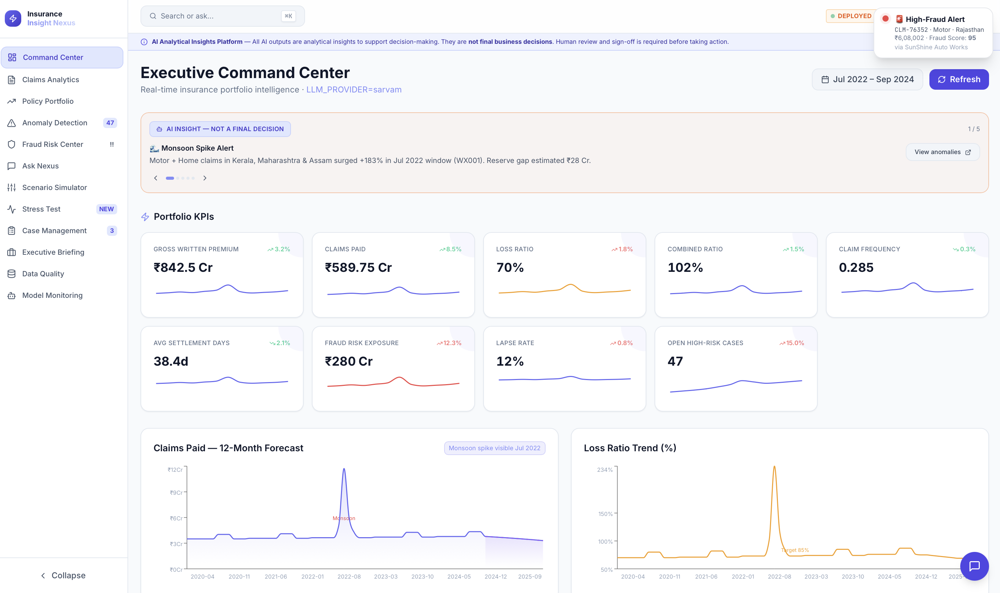
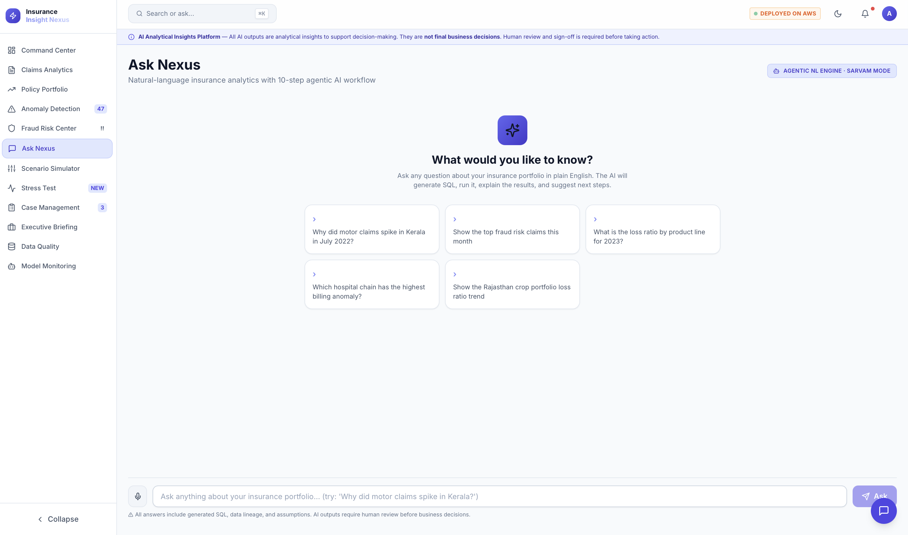
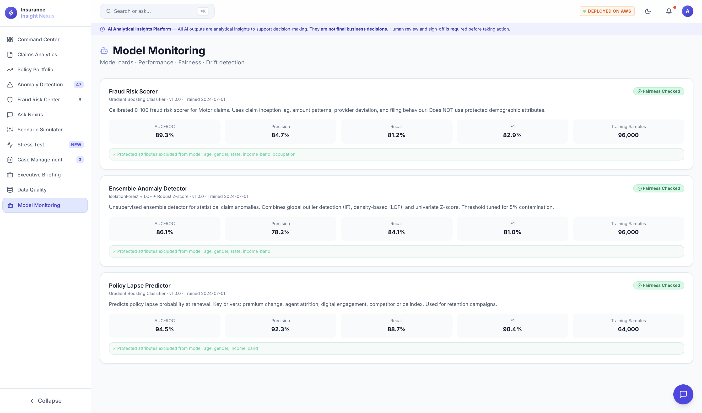
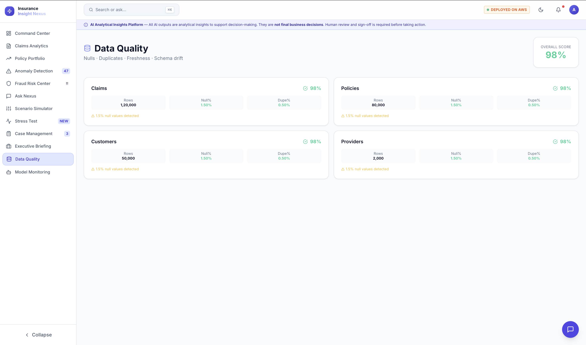
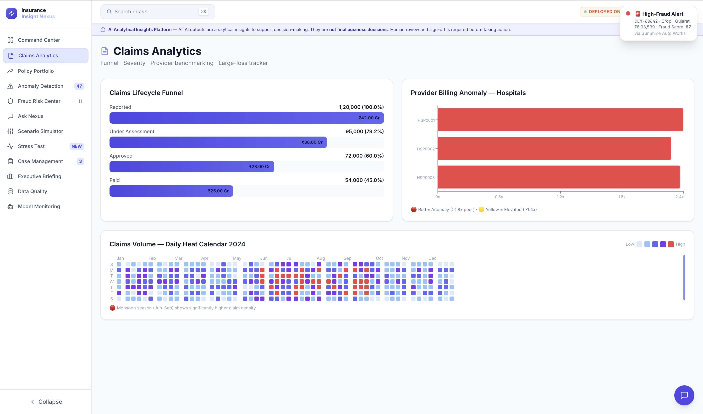
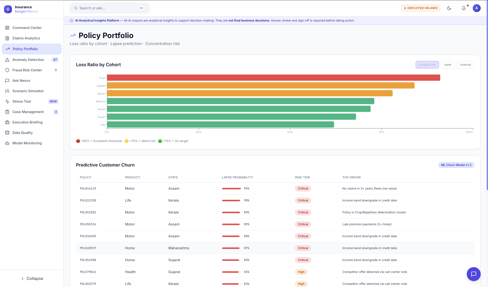
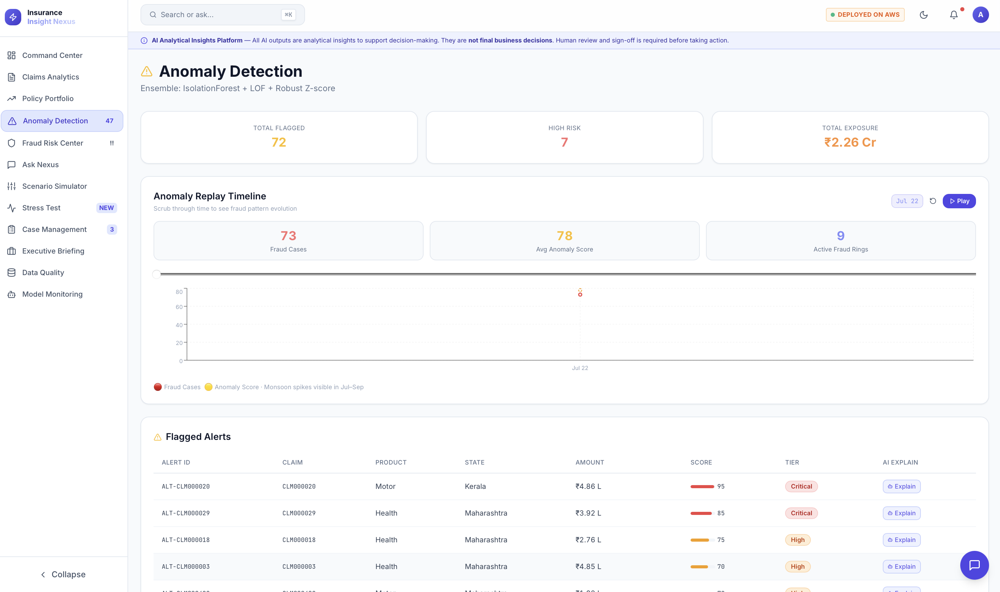
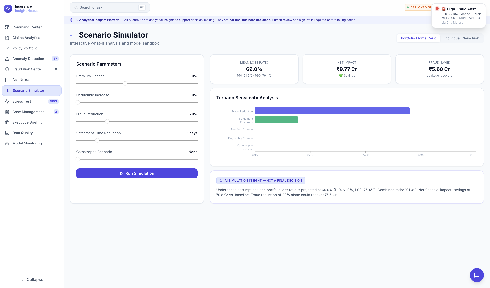
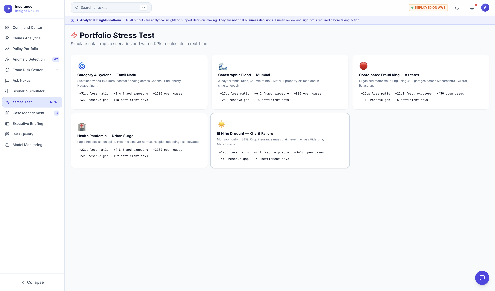
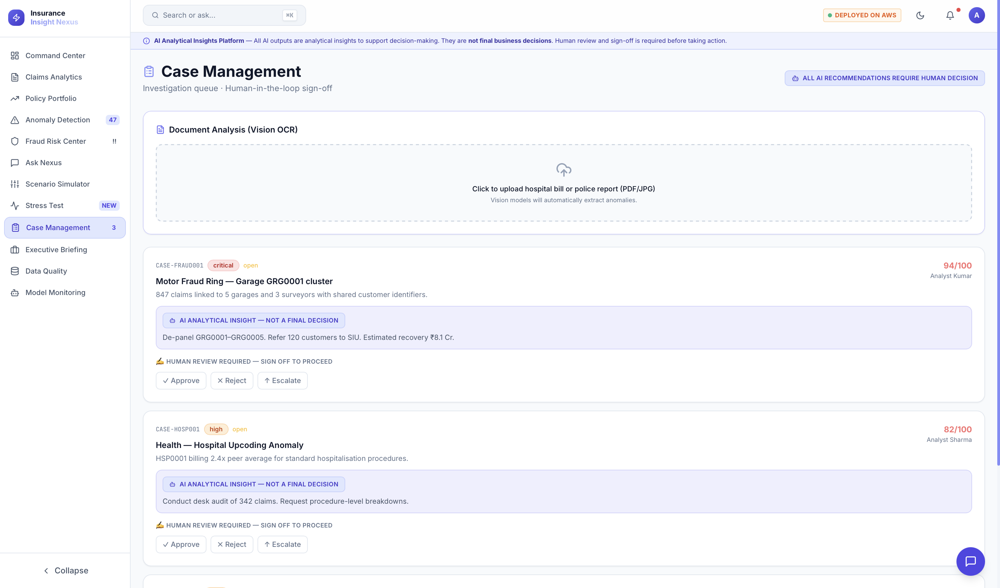

<div align="center">
  <h1>🛡️ Insurance Insight Nexus 🚀</h1>
  <p><b>A High-Performance, Agentic AI-Driven Analytics & Fraud Detection Platform</b></p>

  <!-- Badges -->
  <p>
    
    
    
    
    
  </p>
</div>

<hr/>

> [!TIP]
> **Welcome to the future of insurance intelligence!** Nexus democratizes data access using an embedded analytical database and cutting-edge agentic workflows.

## 📑 Table of Contents
- [✨ Architecture & Tech Stack](#-architecture--tech-stack)
- [🔥 Key Capabilities](#-key-capabilities)
- [🛡️ Security & Guardrails](#️-security--guardrails)
- [🚀 Deployment Guide](#-deployment-guide)
- [📸 Screenshots](#-screenshots)
- [📜 Licensing](#-licensing)

---

## ✨ Architecture & Tech Stack

Nexus is strictly layered to ensure maximum performance, fault tolerance, and security.

### 🌐 Frontend (The Interface)
- **Framework**: React 18 & Vite ⚡
- **Styling**: TailwindCSS 🎨
- **Viz Magic**: Recharts, React-Globe, D3 📊
- **State Mgmt**: React Query 🔄

### 🧠 Backend (The Brains)
- **Framework**: FastAPI & Uvicorn 🏎️
- **Data Layer**: DuckDB + Parquet (Sub-second Analytics! 🦆)
- **Processing**: Pandas, NumPy 🐍
- **AI Core**: Amazon Bedrock (Agentic intent & SQL generation) 🤖
- **Speech**: Sarvam AI 🎙️

### ☁️ Infrastructure (AWS CDK)
- **Compute**: Amazon ECS Fargate (Serverless 💪)
- **Network**: Application Load Balancer & CloudFront 🌍
- **Storage**: Amazon S3 🪣
- **Database**: Amazon DynamoDB (Compliance Ledger 📒)
- **Secrets**: AWS Secrets Manager 🔒

---

## 🔥 Key Capabilities

1. 🗣️ **Natural Language Analytics (Ask Nexus)**  
   Agentic workflow translates plain English into optimized SQL. Dynamic parameter injection ensures immediate insights without manual data engineering.

2. 🕸️ **Fraud Network Visualization**  
   Automatically scores claims and builds entity relationship graphs to expose coordinated fraud rings via shared providers and hotspots.

3. 🧑‍⚖️ **Human-in-the-Loop Compliance**  
   AI generates insights; humans make decisions. A Case Management queue ensures every approval/escalation is immutably logged to DynamoDB.

4. 📈 **Executive Command Center**  
   A beautiful, real-time pulse of portfolio health: policies, claims, lapse rates, and fraud exposure!

---

## 🛡️ Security & Guardrails

> [!IMPORTANT]
> Nexus is designed for financial sectors. Security is paramount.

- **Dynamic SQL Validation**: Strict AST validation blocks destructive commands (`DELETE`, `DROP`, `INSERT`, `TRUNCATE`).
- **Least Privilege Access**: IAM roles are scoped exclusively to required Bedrock models and DynamoDB tables.
- **Immutable Infrastructure**: Provisioned via AWS CDK for repeatable, secure, and rollback-ready deployments.

---

## 🚀 Deployment Guide

Deploying is fully automated via AWS CDK! Check out our [Full Deployment Guide](docs/DEPLOYMENT_GUIDE.md) for detailed steps.

> [!NOTE]
> **Prerequisites:**
> - AWS CLI configured
> - Node.js
> - Python 3.10+
> - Docker

```bash
# 1. Set your region
export AWS_REGION=us-east-2

# 2. Let the magic happen!
./scripts/first_deploy.sh
```

---

## 📸 Screenshots

Take a look at Nexus in action:

<div align="center">
  
  
  
  
  
  
  
  
  
  
</div>

---

## 📜 Licensing

This project is provided for hackathon demonstration purposes. Ensure all dependencies and cloud resources comply with your organizational security policies before adopting in production.
