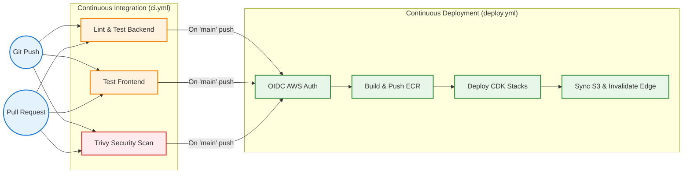

# Continuous Integration & Deployment (CI/CD)

  
<b>Shipping Code with Confidence using GitHub Actions</b>

---

Insurance Insight Nexus relies on a robust CI/CD pipeline built with **GitHub Actions** to ensure code quality, security, and seamless deployments.

## The Pipeline Workflow

---

## 1. CI Pipeline (`ci.yml`)

This pipeline guarantees that the main branch remains green and secure.

> [!NOTE]
> **Triggers On:** `push` and `pull_request` to the `main` branch.

### The Jobs:
- **Backend Testing:** Runs the `Ruff` linter and the `Pytest` test suite for the FastAPI core.
- **Frontend Testing:** Runs `ESLint` and a dry `Vite` build to ensure React compiles flawlessly.
- **Security Scanning:** Leverages `Trivy` to automatically scan for High and Critical CVEs across dependencies.

---

## 2. CD Pipeline (`deploy.yml`)

The CD pipeline takes validated code and pushes it globally via AWS.

> [!NOTE]
> **Triggers On:** `push` directly to the `main` branch (after CI completes).

### The Deployment Process:
1. **Authenticate:** Securely assumes an AWS IAM role via OIDC (No long-lived access keys!).
2. **Prepare Environment:** Installs Node.js, Python, and the AWS CDK CLI.
3. **Deploy Script:** Executes `./scripts/deploy.sh` which:
   - Builds the Docker image and pushes it to **Amazon ECR**.
   - Synthesizes and deploys the **AWS CDK** infrastructure.
   - Builds the React frontend and syncs it to the **Amazon S3** bucket.
   - Triggers an **Amazon CloudFront** cache invalidation to instantly serve the new version!

---

## Setup Requirements for GitHub Actions

> [!IMPORTANT]
> To enable automated deployments, the repository requires the following secret:

- **`AWS_ROLE_ARN`**: The ARN of the IAM role configured with an OIDC identity provider for GitHub Actions. This role must be scoped with permissions to assume the underlying CDK deployment roles.
